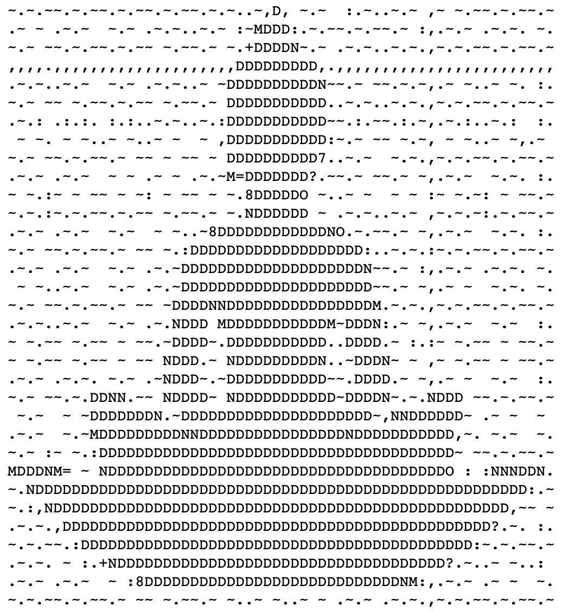

 
# Chinese-NLP_Buddhist-Texts
This notebook uses the SpaCy Chinese model to tokenize and analyze parts of speech for a short Buddhist text. Mistakes in the tags were corrected by hand to train an improved model for Pre-Modern Literary Chinese Texts. It was built with Pandas, SpaCy, and Xiaoquan Kong's Chinese SpaCy model. It implements a Part of Speech tagger and visualizations using diSplaCy.

[MyBinder Jupyter Notebook](https://mybinder.org/v2/gh/catshowjudge/Chinese-NLP_Buddhist-Texts/master?filepath=Computational-Linguistics_Buddhist-Texts_Chinese-NLP-Pandas-SpaCy-displaCy.ipynb) | [Static HTML](https://catshowjudge.github.io/Chinese-NLP_Buddhist-Texts/Computational-Linguistics_Buddhist-Texts_Chinese-NLP-Pandas-SpaCy-displaCy-1.htm)

